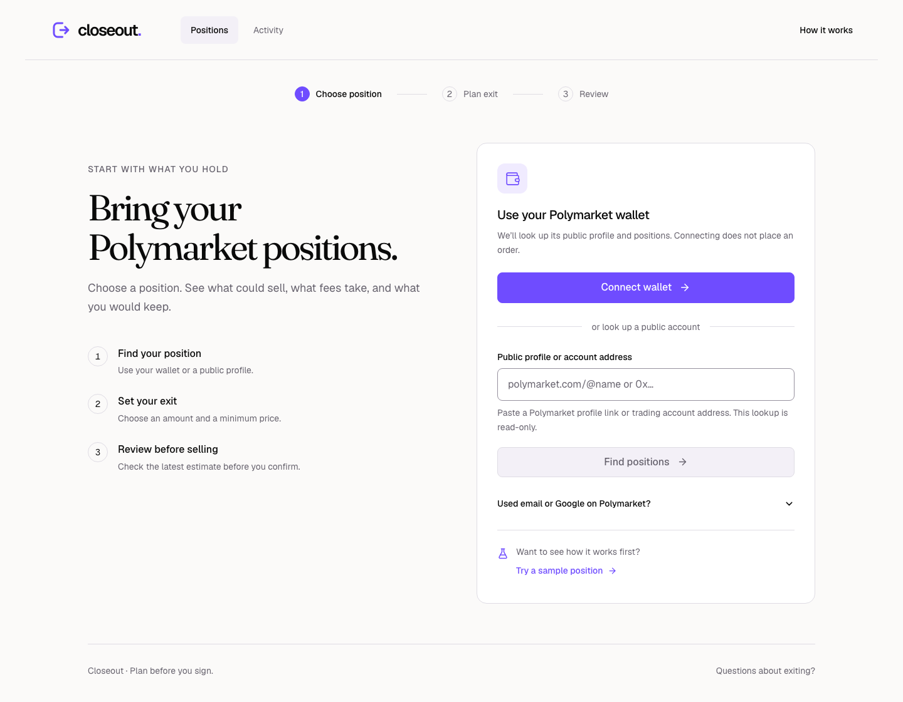
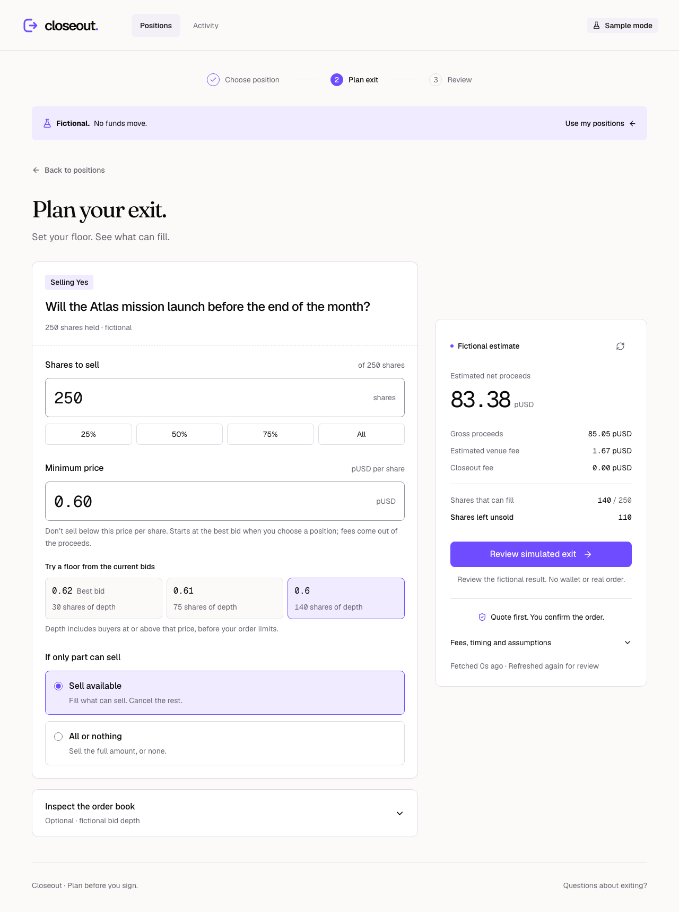
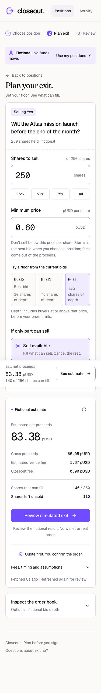
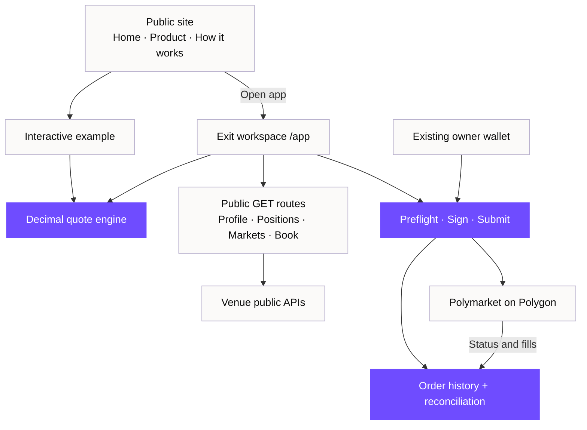
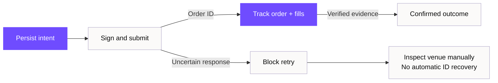

[](https://github.com/mohit-1710/closeout/actions/workflows/checks.yml)


# Know your exit. Before you sign.

The market price is a single number. Selling your whole position is a different question.

**Closeout helps Polymarket traders see what could sell, what fees take, and what stays unsold.** Bring your public portfolio, choose a position, and see an exit plan before authorizing an order.

[Website](https://closeout-ashen.vercel.app) · [Open app](https://closeout-ashen.vercel.app/app) · [Try an example](https://closeout-ashen.vercel.app/app?mode=example) · [How it works](https://closeout-ashen.vercel.app/how-it-works)


## A clearer decision

A displayed price does not tell you how much of a position can fill at that price. Closeout makes the available depth and the remainder visible together.

| Step | What you get |
| --- | --- |
| **Bring your portfolio** | Connect the wallet you use with Polymarket, or paste a public profile link or account address. |
| **Choose a position** | Start with the shares actually held. Public lookup needs no signature. |
| **Set your floor** | Begin at the current best bid. Adjust the share amount or minimum gross price deliberately. |
| **See the tradeoff** | Estimated proceeds, venue fees, fillable shares and shares left unsold. |
| **Choose the behavior** | Sell available shares at your floor, or require the entire quantity to fill. |
| **Review and follow** | Refresh the plan, authorize from the owner wallet, and track the order's outcome. |

The app opens with portfolio lookup, not a prefilled order. Errors stay beside the editable input; a recently viewed public profile can be looked up again on the next visit. A separate sample journey lets anyone try the planner without a wallet.



The homepage also includes a working preview powered by the same decimal quote engine. Change the floor and the eligible depth changes with it.

<details open>
<summary><strong>The exit workspace</strong></summary>



In this **fictional example**, 250 shares at a 0.60 pUSD floor have 140 shares of eligible depth and 110 left unsold. “Sell available” models a partial fill; “All or nothing” blocks the exit. No funds move.

</details>

<details>
<summary><strong>On mobile</strong></summary>



</details>

## Architecture

The public website explains the product without initializing a wallet. The trading workspace has its own provider boundary. Four server routes read public identity and market data; signing and order submission happen in the browser.



[HLD and module contracts](docs/architecture.md) · [Exit math](docs/exit-math.md) · [Execution integration](docs/execution-integration.md)

### Decisions that matter

- **Decimal arithmetic:** prices and quantities retain their precision through provider parsing and quote calculation.
- **Explicit uncertainty:** unknown fees block submission; failed live reads stay errors. Example data is an intentional mode.
- **Fresh review:** the plan is refreshed before authorization. A quote is a snapshot, not a guaranteed fill.
- **Owner authority:** reading an address grants no signing permission. The wallet must own the supported venue account.
- **Persistent order safety:** save intent before submission; uncertain outcomes block blind retries. Reconcile venue evidence before declaring completion.



An uncertain submission without a verified order ID keeps the account locked. Closeout does not offer a “clear and retry” shortcut or automatically recover that ID.

## Run locally

Use **Node 24 or newer**. Public-data parsing relies on the modern JSON reviver context.

```sh
git clone https://github.com/mohit-1710/closeout.git
cd closeout
npm ci
npm run dev
```

Open [localhost:3000](http://localhost:3000) for the website. In [/app](http://localhost:3000/app), paste a public Polymarket profile to inspect holdings without a wallet, or use [/app?mode=example](http://localhost:3000/app?mode=example), choose the fictional Atlas position, and try a different floor. Public lookup and planning need no key or wallet.

For the Privy chooser, copy `.env.example` to `.env.local`, set `NEXT_PUBLIC_PRIVY_APP_ID`, enable wallet authentication, and allow your exact origin. **No app secret is needed.** Without an App ID, the workspace supports an injected Ethereum wallet. See [wallet setup](docs/privy-setup.md) and [deployment](docs/deployment.md).

### Checks

```sh
npm test
npm run format:check
npm run build
npm run typecheck

# With the app running in another terminal:
npm run test:site
npm run test:browser
npm run test:privy  # requires a configured public Privy App ID
```

The September 12 onboarding release passed **282 unit/service tests**, **26 site checks**, **18 journey checks**, and **4 actual Privy chooser checks**. The journey suite covers editable lookup failures, stale responses, real holding quantities, returning profiles, unavailable books and the full sample path. The [GitHub workflow](.github/workflows/checks.yml) runs the locked install, unit tests, formatting check and production build. Browser suites run separately and save reports under ignored `.artifacts/qa/`. [Verification scope and reproduction](docs/verification.md).

**Execution status:** public reads, planning and fictional fills are exercised. Actual owner authentication, signing, live orders and cancellations have not been validated end to end. Final live `netReceipt` remains unknown until proceeds reconciliation is implemented. Closeout does not deploy accounts, change approvals, or move deposits and withdrawals.

## Project map

```text
src/
  app/
    page.tsx              homepage
    product/              product explanation
    how-it-works/         workflow and questions
    app/                  trading route and wallet boundary
    api/                  public profile, position, market and book reads
  components/
    journey/              onboarding, portfolio, planner, review and activity
                          site, preview, workspace shell and wallet UI
  hooks/                  account, review and order coordination
  lib/                    decimal math, data adapters and order services
scripts/                  browser checks and brand-asset generation
docs/                     architecture, math, integration and operations
  images/                 curated product screenshots
```

**Stack:** Next.js 16, React 19, TypeScript, Tailwind CSS 4, decimal.js, Privy, viem and the Polymarket SDK. The warm-white and violet visual system uses Fraunces, Geist and Geist Mono; tokens and usage live in [brand.md](brand.md).

| Public endpoint | Purpose |
| --- | --- |
| `GET /api/profile?input=...&source=manual` | Resolve an exact public profile or position-account address. Wallet lookup uses `source=wallet`. |
| `GET /api/markets?q=...` | Discover markets; `conditionId` supports exact lookup. |
| `GET /api/book?tokenId=...&conditionId=...` | Read an outcome book bound to its market. |
| `GET /api/positions?account=0x...` | Read public holdings with pagination-limit metadata. |

All responses disable caching. There is no server signing or order-placement endpoint.

## Development

Built for **ETHOnline 2026** by [Mohit](https://github.com/mohit-1710). Codex assisted substantially with implementation, tests and documentation. The [Git history](https://github.com/mohit-1710/closeout/commits/main/) records the actual work; [integration feedback](FEEDBACK.md) documents findings for the SDK teams.
