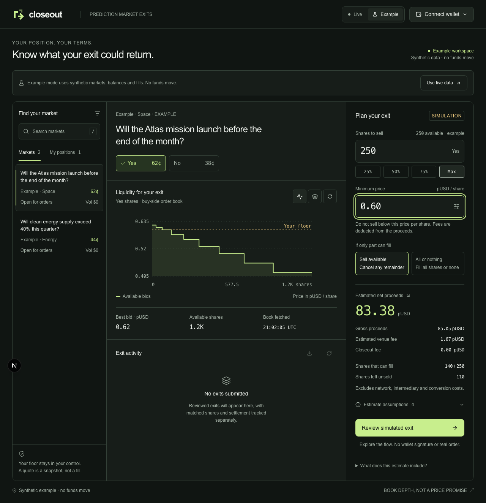
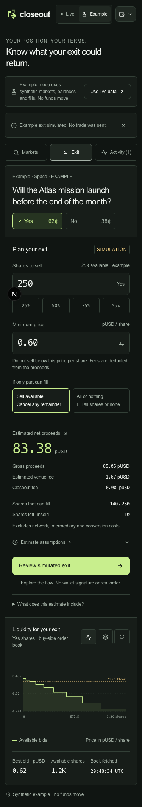
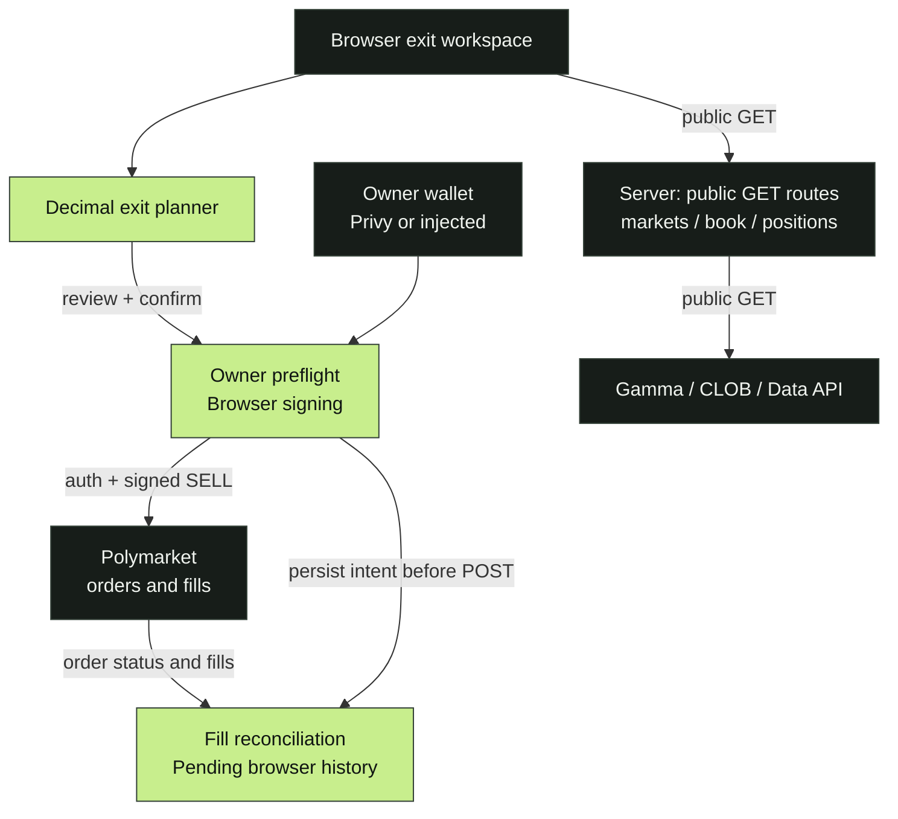
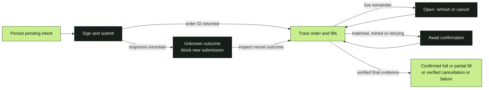

[](https://github.com/mohit-1710/closeout/actions/workflows/checks.yml)


# Know what your exit can fill before you sign.

Closeout helps a Polymarket trader plan an exit from an existing position. Inspect live bids, set a minimum price per share, and see estimated proceeds, fees and shares left unsold. Review the fresh plan before authorizing a sell from the account's owner wallet.

**Built for ETHOnline 2026.** Public reads, simulated exits and the real Privy chooser are tested. Owner authentication and real trades remain unverified; final live net proceeds are unknown.

[Open Closeout](https://closeout-ashen.vercel.app) · [Architecture](#architecture) · [Order lifecycle](#order-lifecycle) · [Decisions](#design-decisions) · [Verification](#verification) · [Run](#run-locally) · [API](#public-api) · [Build history](docs/build-history.md)

## See it



*Example mode: fictional market, balances and fills. No funds move.*

At a **0.60 pUSD/share floor**, the example's **250-share** request has **140 shares** of eligible bid depth and **110 left unsold**. This is a supplied snapshot, not a trading result.

| Choice | What the example shows |
| --- | --- |
| **FAK — sell available** | Model 140 shares filling at or above the floor; cancel the unmatched remainder. |
| **FOK — all or nothing** | Block the 250-share exit because eligible depth cannot fill it entirely. |

<details>
<summary>Mobile example</summary>



The same fictional flow on mobile. See [browser evidence](docs/qa/browser-smoke.json).

</details>

## What it does

| Area | Behavior |
| --- | --- |
| Discover | Search live markets and inspect their outcome books; provider errors remain errors. |
| Plan | Sweep eligible bids with decimal arithmetic; estimate fees, proceeds and unsold shares. |
| Inspect positions | Load a public account's first 100 positions, with a truncation notice when more exist. Address lookup grants no authority. |
| Review | Check owner, chain, geography, unreserved holdings, approval, market constraints and a refreshed quote. |
| Follow an order | Poll active records, reconcile fills, cancel an eligible live remainder and export JSON activity. |
| Handle uncertainty | Persist pending evidence and lock the account against blind retries after an uncertain submission. |

## Architecture

Public reads go through three fixed-origin server routes. Account authentication, signing and order submission go directly from the browser to Polymarket. The lime blocks contain the calculation, authorization and history decisions.



The signer and Polymarket account address can differ. Closeout verifies their supported relationship; it does not create another wallet and assume that wallet owns the portfolio. SDK credentials stay in memory. Local history contains order metadata, not signing keys.

## Order lifecycle

These are implemented reconciliation states, not evidence of an executed trade.



**Accepted is not confirmed.** Related trade references and confirmed quantities must agree. A missing order ID requires manual venue inspection; there is no “clear and retry” shortcut. Confirmed shares and transaction hashes can be tracked, but final live `netReceipt` remains `null` until proceeds reconciliation is implemented.

## Design decisions

| Decision | Reason |
| --- | --- |
| Decimal strings throughout | Preserve monetary precision, including provider JSON values. |
| Gross price floor | Bound the sell price per share without promising an after-fee receipt. |
| Unknown fees block submission | A failed metadata lookup must not become a zero-fee estimate. |
| Fresh review | Book fetches expire after 15 seconds; the last-change timestamp stays separate. |
| Separate example mode | A failed live request never silently supplies fictional balances or fills. |
| Browser and account locks | Serialize history writes and final submission across tabs. Preserve every unresolved record; exceeding 100 active records fails closed. |

Fee estimates use market parameters. Displayed levels may split into multiple matches, changing rounding. Network, intermediary, conversion and withdrawal costs are excluded; pUSD is venue collateral, not a bank withdrawal promise. [Math and boundaries](docs/exit-math.md).

## Verification

Saved local evidence from **September 12, 2026 IST**:

| Check | Recorded result | Evidence |
| --- | --- | --- |
| Unit and service tests | **209 passed**; SDK/provider interactions are mocked | [Build report](docs/qa/build-verification.md) |
| Responsive browser suite | **13 passed**; example fills and controlled GET failures | [Browser report](docs/qa/browser-smoke.json) |
| Actual Privy chooser | **4 passed**; public config, open, dismiss and reopen | [Privy report](docs/qa/privy-integration-current.json) |
| Public live reads | Market, book, fee metadata and empty address lookup exercised | [Live-read report](docs/qa/live-read-browser.json) |
| Production build | Passed locally with configured Privy | [Build report](docs/qa/build-verification.md) |

The separate [GitHub workflow](.github/workflows/checks.yml) installs locked dependencies, runs tests and builds. [Cloud CI passed for `b65de78`](https://github.com/mohit-1710/closeout/actions/runs/34703514251); later commits have their own runs, shown by the dynamic badge. CI does not run the browser or Privy suites; their saved results are local evidence.

The [public deployment](https://closeout-ashen.vercel.app) passed unauthenticated page, market discovery and order-book reads on September 12 at 15:55 UTC: 40 markets returned, and the inspected book included known fee metadata. [Deployment evidence](docs/qa/deployment-public-reads.json) · [Deployment setup](docs/deployment.md). These checks did not authenticate a wallet or place an order.

**No real wallet was connected or used to sign. No real order, cancellation, approval, deposit or withdrawal was sent.** No paying users, measured savings or sponsor eligibility are claimed. The [dependency snapshot](docs/qa/dependency-audit.json) retains moderate wallet-stack advisories; this is not an independent security audit.

## Run locally

Use **Node 24+**. Public parsing depends on the modern JSON reviver context.

```sh
git clone https://github.com/mohit-1710/closeout.git
cd closeout
npm ci
npm run dev
```

Open **http://localhost:3000**. Browsing and planning require no wallet or key. Choose **Example** to explore fictional fills.

```sh
npm test
npm run build
npm run typecheck   # standalone tsc after Next generates its types
npm start          # production server; stop the dev server first
```

With a server running in another terminal:

```sh
npm run test:browser
npm run test:privy  # requires a configured public Privy App ID
```

### Privy and an existing account

Copy `.env.example` to `.env.local`, set **`NEXT_PUBLIC_PRIVY_APP_ID`** to your public App ID, enable Wallet authentication, and allow the exact local/deployment origins in Privy. Restart development or rebuild production after changing it. **No app secret is required.** Without the ID, the app uses an injected Ethereum wallet. [Setup](docs/privy-setup.md).

Live execution requires an existing deployed, funded Polymarket account and the correct outcome-token approval. Connect its owner signer and load the account address. Geography is checked from the browser; blocked or unknown eligibility disables submission. Closeout does not deploy accounts, change approvals or proxy trades through its server.

Web Locks require HTTPS or localhost. Browser-local metadata can be erased; inspect venue history after clearing storage or changing devices. See [remaining owner actions](ACTION-REQUIRED.md) before attempting a live flow.

## Public API

All routes are GET-only and return `Cache-Control: no-store`. They require outbound HTTPS to the venue's public providers.

| Route | Purpose |
| --- | --- |
| `/api/markets?q=...` | Search or discover markets; `conditionId` supports exact lookup. |
| `/api/book?tokenId=...&conditionId=...` | Read a book bound to its market and outcome. |
| `/api/positions?account=0x...` | Read public holdings with pagination-limit metadata. |

There is no server signing or order-placement endpoint. [SDK integration notes](docs/execution-integration.md) document the pinned package, exchange-version handling and runtime export workaround.

## Project layout

```text
src/app/api/       public market, book and position reads
src/components/    workspace, wallet context and presentation
src/hooks/         review, account/session binding and order coordination
src/lib/           decimal planner, adapters, trading service, reconciliation
scripts/           isolated browser and Privy smoke checks
docs/qa/           dated local reports and screenshots
docs/              build history, integration notes, demo and submission draft
```

## Build record

The [actual commit history](docs/build-history.md) begins September 12 IST; it is not a reconstructed daily work log. Codex generated and iterated on substantial application code, tests and documentation. Mohit supplied the company-first brief, authorized the build and configured Privy. Open-source scaffolding and SDKs are disclosed in the [submission draft](docs/submission-draft.md).

[Demo script](docs/demo-script.md) · [Copyable submission](docs/submission.html) · [Build scope](docs/build-context.md) · [Integration feedback](FEEDBACK.md) · [Owner actions](ACTION-REQUIRED.md)
