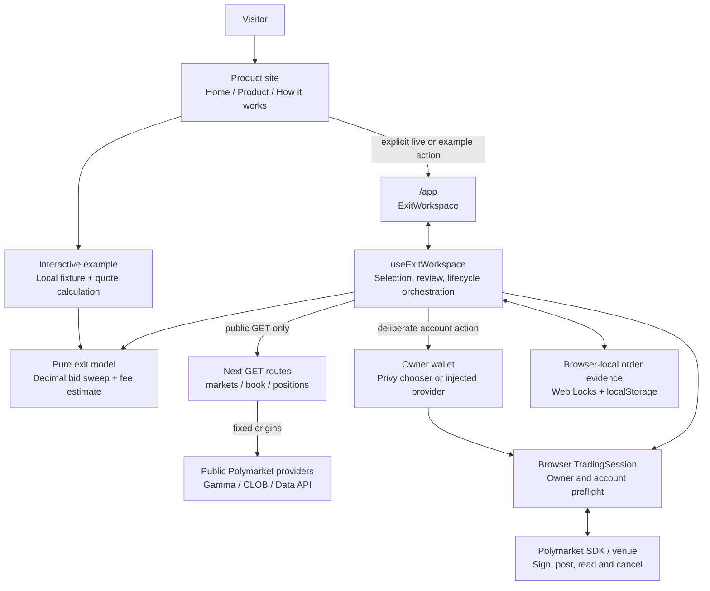
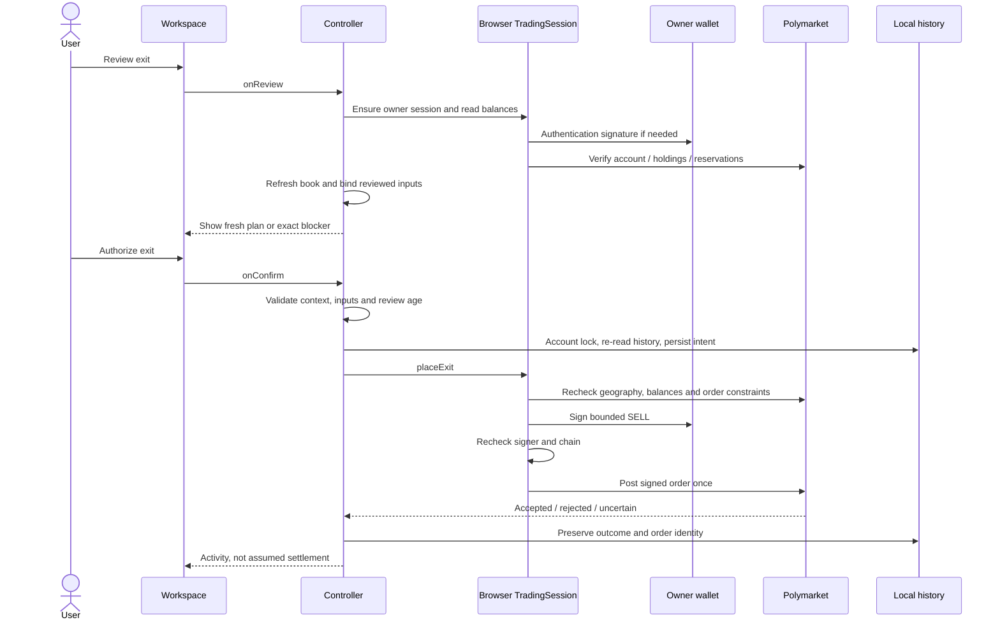

# Closeout architecture

This document describes the implementation in this repository as of September 12, 2026. Closeout helps an existing Polymarket account holder inspect bid depth, plan a sell within a gross price floor, and follow the order’s state. The product site explains that workflow; `/app` contains it.

Public reads, fictional examples and opening the wallet chooser have been exercised. End-to-end owner authentication and a real trade remain unverified. Implemented safeguards and mocked service tests do not establish successful live execution, final net proceeds or measured user savings.

## High-level design

Closeout is one Next.js application with server-rendered product pages, a client-side workspace and three public-data route handlers. It has no application database, background worker, server order endpoint or Closeout smart contract.

The server supplies public information, not trade authority. Authenticated venue requests and signing remain in the browser. The user’s browser also checks geographic availability directly; server location is not substituted for user eligibility.

### Route and rendering boundaries

| Route or component | Responsibility |
| --- | --- |
| [Root layout](../src/app/layout.tsx) | Shared metadata, fonts and global theme. It does not mount the wallet provider. |
| [Home](../src/app/page.tsx), [Product](../src/app/product/page.tsx), [How it works](../src/app/how-it-works/page.tsx) | Public explanation and real links into the planner. Site navigation/footer come from [SiteShell](../src/components/site-shell.tsx). |
| [ExitPreview](../src/components/exit-preview.tsx) | A small client interaction using the fictional Atlas book and the same quote calculation as the workspace. It does not authorize orders. |
| [/app layout](../src/app/app/layout.tsx) | Mounts wallet infrastructure only within the trading destination. |
| [/app page](../src/app/app/page.tsx) | Selects `example` only for the explicit `mode=example` value; otherwise selects `live`. A keyed [TradingWorkspace](../src/components/trading-workspace.tsx) initializes the controller. |
| [/api/markets](../src/app/api/markets/route.ts) | Public discovery, search or exact condition lookup. |
| [/api/book](../src/app/api/book/route.ts) | Public book and market metadata, bound to a requested condition and outcome token. |
| [/api/positions](../src/app/api/positions/route.ts) | Read-only positions for a public account address. |

All three API routes are Node-runtime, GET-only, dynamic and `no-store`. They return input errors as 400 and upstream/normalization failures as 502. There is no server signing, approval, funding or order-placement route.

The shared theme lives in [globals.css](../src/app/globals.css). Tailwind CSS v4 utilities and `@apply` handle layout, spacing, typography and responsive rules; referenced component styles retain token-based illustrations and specific interaction selectors. Public-page client islands are limited to navigation and the local example. Loading the explanatory pages does not mount the `/app` wallet provider.

## Low-level design

### Responsibilities and contracts

| Module | Owns | Does not own |
| --- | --- | --- |
| [types.ts](../src/lib/types.ts) | UI DTOs: `Market`, `OrderBook`, `Position`, `ExitQuote`, `TrackedOrder`, `WorkspaceController`. | Provider parsing, wallet authority or arithmetic. |
| [public-data.ts](../src/lib/public-data.ts) | Fixed-origin fetches, query validation, exact numeric parsing, provider-to-DTO normalization, source identity checks. Its fetcher is injectable. | Authentication, trading or automatic source substitution. |
| [exit-plan.ts](../src/lib/exit-plan.ts) | Pure, non-mutating decimal bid sweep, fee model, order-type semantics and caller-supplied freshness policy. | Network, clock reads, wallet state, signatures or settlement assertions. |
| [quote.ts](../src/lib/quote.ts) | Maps the domain plan into `ExitQuote`; applies the workspace’s age, tick, size, share-precision and accepting-orders checks. | Enforcing an after-fee receipt at the venue. |
| [wallet-provider.tsx](../src/components/wallet-provider.tsx) | `TradingWalletContext`, explicit connection, Polygon selection, provider access and account/network invalidation. | Inferring that an arbitrary loaded portfolio is owned by the connected signer. |
| [trading-client.ts](../src/lib/trading-client.ts) | `TradingSession`: owner/account validation, unreserved balances, approvals, exchange selection, one bounded sell, exact-order reads and cancellation. | Server-held credentials, account deployment, automatic approval changes or blind POST retries. |
| [order-status.ts](../src/lib/order-status.ts) | Pure reconciliation of a saved order against venue order/trade identities and confirmed quantities. | Treating acceptance as settlement or computing final net proceeds. |
| [order-history.ts](../src/lib/order-history.ts) | Validation and bounded compaction of saved live-order records. | Storage transport, cross-tab locking or remote backup. |
| [use-exit-workspace.ts](../src/hooks/use-exit-workspace.ts) | Orchestration: selection, data loading, review state, account session, persistence, polling, errors and export. Returns the screen controller. | Rendering or changing the venue’s execution semantics. |
| [ExitWorkspace](../src/components/exit-workspace.tsx) | Responsive presentation, labeled inputs, depth view, dialogs and controller callbacks. | Direct SDK trading calls. |

### Data contracts that carry financial meaning

- Executable prices, share amounts and monetary outputs are decimal strings. The public parser preserves numeric JSON lexemes before binary rounding; the supported Node version is specified in [package.json](../package.json). Display-only discovery totals are not used as executable balances.
- `OrderBook` preserves both the provider’s last-change `timestampMs` and local fetch completion `fetchedAt`. Quote freshness uses `fetchedAt`; an unchanged book can legitimately have an older last-change timestamp.
- Fee state is a discriminated union: `known`, explicitly `none`, or `unknown`. Missing or malformed metadata must not become a zero fee. Unknown fees preserve available depth where possible but block submission.
- `ExitPlan.available` describes candidate depth; `estimate` applies order-type and policy gates. An insufficient FOK plan has zero proposed fill. `quote.ts` intentionally preserves candidate depth on other blocked plans so users can inspect it without treating it as executable.
- The floor is a minimum **gross price per share**. The engine’s optional `minNetReceipt` is a modeled veto, is not exposed as a separate workspace input, and cannot enforce a future whole-order net receipt.
- `TrackedOrder.mode` separates live evidence from fictional activity. For live reconciliation, `netReceipt` remains `null`; confirmed shares and transaction hashes are not a reconstructed final pUSD receipt.

### Public read and planning flow

1. The controller fetches market discovery/search, then a condition-bound outcome book. Request counters, abort handling and context keys prevent late results from updating a different selection or account.
2. `public-data.ts` validates market, condition and token membership; book and metadata must agree on tick and minimum size. Duplicate levels, crossed books, conflicting market copies and mismatched positions fail instead of silently producing a quote.
3. Provider requests use fixed origins/paths, omitted credentials, rejected redirects and a 12-second timeout. Response text is checked against a size limit before parsing; this is not a streaming body-size limiter.
4. The model sorts a copy of eligible bids, consumes highest prices first and estimates the supplied fee per consumed level. `quote.ts` adds a 15-second maximum fetch age, minimum order size, allowed tick, nonzero floor and at most two decimals for shares.
5. The visible book refreshes every 10 seconds while the document is visible, except during review or submission. The UI’s age clock updates every second. Review obtains a fresh book; an old preview never reserves liquidity.

Default discovery returns up to 40 markets. Public positions expose the first 100 supported rows with `hasMore`; the UI reports truncation. Redeemable positions are directed to venue redemption rather than submitted as open-market sells.

### Review, authorization and submission

Connecting an EIP-1193 wallet and authenticating a venue session are distinct. A first live review may request the venue authentication signature; the final sell remains a separate confirmation. `createTradingSession` receives the loaded account explicitly, requires the SDK’s `OWNER` relationship, checks existing contract deployment where applicable, and rejects guessed session-key mappings. Its signer wrapper rejects `sendTransaction`, preventing automatic account deployment or approval setup.

The service normalizes six-decimal token balances and subtracts remaining open sell reservations before exposing available shares. It obtains the exchange from the pinned SDK runtime configuration and validates that configuration rather than retaining a fallback address. This internal mapping must be rechecked during an SDK upgrade.

Before posting, the service checks geographic status, holdings, approval presence, floor/tick and order size; it rechecks account and chain after signing. A venue rejection is recorded as a rejection. A transport exception after POST is `SubmissionUncertainError`; the service does not resend it.

### Order lifecycle and browser persistence

Orders are reconciled by order ID, account, outcome token, side, order type and original quantity. Related maker/taker legs are checked separately. Duplicate conflicting trades, missing referenced evidence, confirmed amounts exceeding matched amounts, or a decrease in previously confirmed shares cause an error rather than a fabricated final state.

| State | Meaning in this implementation |
| --- | --- |
| `unknown` | Outcome or evidence is not sufficiently verified; an unresolved submission may have reached the venue. |
| `open` | The venue reports a live remainder. |
| `matched` | Some matching evidence exists, but the complete final state is not established. |
| `settling` | Related fills are matched, mined or retrying and await confirmation. |
| `settled` | All requested shares have consistent venue-confirmed fills. |
| `partial` | A terminal order has a consistent confirmed partial fill; some requested shares were not sold. |
| `cancelled` | The venue confirms cancellation with no matching evidence in the verified record. |
| `failed` | A verified failure/rejection; the detail identifies the stage. It is not a generic successful rollback claim. |

Active known orders poll every five seconds while visible and idle, using the existing authenticated session. A temporary intent without a verified order ID requires manual venue inspection. Cancellation is a deliberate action for an eligible live remainder; subsequent reads determine the resulting state. It cannot reverse a settled fill.

Live records use `localStorage` key `closeout-orders-v1`. A shared Web Lock serializes read/modify/write history operations; a per-account Web Lock coordinates final submission across tabs. Before submitting, the controller re-reads stored evidence and blocks another order for an account with unresolved activity. Storage events synchronize other tabs.

Compaction retains every unresolved record and fills the remaining capacity with the newest terminal records, up to 100 total. More than 100 unresolved records, invalid history, failed persistence or unavailable Web Locks block live submission. Example activity is held in memory and exported only with its fictional label. Browser storage is neither a server audit trail nor cross-device protection; deleting storage can erase local evidence. The venue remains the source to inspect after uncertainty or storage loss.

## Trust boundaries

| Boundary | Enforced behavior and practical limit |
| --- | --- |
| Public address → authority | Portfolio lookup never authorizes a trade. Owner signer and account relationship are checked separately. |
| Provider response → financial model | Runtime normalization checks identity, precision and constraints. A recent fetch still cannot prove future liquidity or feed completeness. |
| Review → order | Reviewed input/context and age are checked, then an explicit signed sell is submitted. The gross floor is not an all-in net-return guarantee. |
| Browser → venue | Geography is checked from the user’s browser. Blocked or unknown status disables submission; the server does not reroute orders. |
| Wallet → application | EIP-1193 providers supply signing; Closeout does not request seed phrases. Session credentials are memory-only. Privy’s public App ID is configuration, not an application secret. |
| Live → example | Explicit mode selection chooses fictional fixtures and simulated activity. Live failures remain failures. `/app` may still initialize wallet-provider/geography services in Example mode; it is not advertised as a completely offline route. |
| Acceptance → settlement | Status reconciliation requires matching identities, complete references and consistent confirmed quantities. Final live net proceeds remain unreconciled. |

The application adds no analytics product. Third-party wallet infrastructure can make its own initialization requests; browser QA classifies those separately from any authentication, linking or financial write. This is not a claim that mounting a wallet SDK generates zero background traffic.

## Design principles and extension points

The implementation uses functions, React composition and structural TypeScript interfaces. It does not add class factories, a dependency container or a repository layer merely to label itself SOLID.

- **Single responsibility:** the financial model, source normalization, wallet connection, trading service and settlement reconciliation are separate modules. The controller is intentionally the current orchestration boundary, but it is large and also coordinates history and polling. Future maintenance can extract those lifecycles behind the existing screen contract; they are not already separate services.
- **Open/closed behavior:** supported fee shapes and explicit FAK/FOK types make changes visible at their boundaries. A new venue still needs its own identity, fee, authority and settlement mapping. It is not a plug-in proven by renaming an endpoint.
- **Substitution:** injected and Privy connections expose `TradingWalletContext` and an EIP-1193 provider. Runtime chain/account checks remain necessary. There is no inheritance hierarchy for which a stronger Liskov claim would be useful.
- **Interface segregation:** `TradingSession` exposes the operations needed for this exit workflow. `WorkspaceController` is deliberately a broad screen-facing contract; smaller subcontrollers would be justified if independent screens are added.
- **Dependency direction:** pure calculation and reconciliation do not import React, storage or the SDK. Public fetchers can be substituted in tests. The orchestration hook still directly imports concrete services; the project does not claim full dependency inversion.

Useful next extensions are narrowly defined: paginate positions without hiding coverage limits; add a sequence-checked order-book subscription while retaining snapshot validation; reconcile final collateral proceeds with complete fee attribution; add account support only with explicit ownership/approval tests; or extract history/polling orchestration without changing persisted uncertainty semantics. Funding, bridging, redemption, market recommendations and unattended exits are outside this implementation.

## Verification and code navigation

The relevant tests are colocated with the financial boundaries: [exit-plan tests](../src/lib/exit-plan.test.ts), [quote tests](../src/lib/quote.test.ts), [provider normalization tests](../src/lib/public-data.test.ts), [trading-service tests](../src/lib/trading-client.test.ts), [reconciliation tests](../src/lib/order-status.test.ts) and [history tests](../src/lib/order-history.test.ts). Service tests mock wallet/SDK interactions; they do not prove a live wallet or trade.

With a local server already running, [browser-smoke.mjs](../scripts/browser-smoke.mjs) exercises the explicit example, selected failure states and responsive workspace; [privy-smoke.mjs](../scripts/privy-smoke.mjs) checks the real chooser without selecting or authenticating a wallet; [site-smoke.mjs](../scripts/site-smoke.mjs) checks the public journey and example entry. See [verification](verification.md) for dated results and their scope. `npm test`, `npm run typecheck` and `npm run build` are the project checks; current outputs belong in verification evidence rather than permanent architecture claims.
